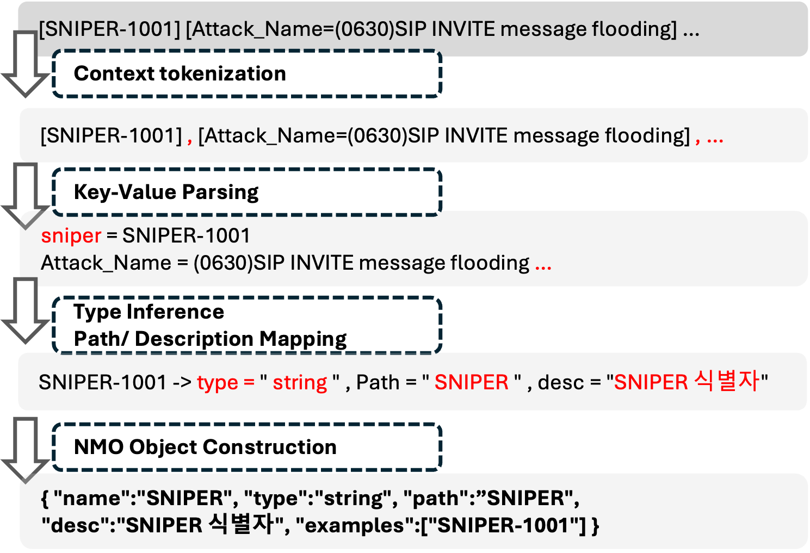
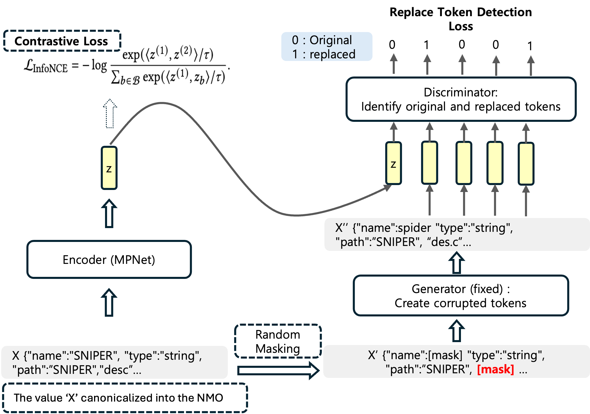
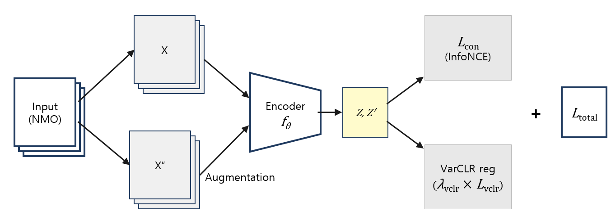

# Modular Semantic Schema Mapping for Heterogeneous Syslogs

This repository implements a **modular semantic schema mapping framework** for heterogeneous security syslogs. The framework maps source log fields from heterogeneous SOC/SIEM environments to a unified target schema while balancing mapping accuracy, latency, controllability, and deployability.

The current local implementation centers on the **NMO-MDV** instantiation. The framework is also structured so that other semantic matching modules, including **Agent-OM**, can be evaluated under the same canonicalization, scoring, and calibration pipeline.

- **NMO**: Normalized Mapping Object, represented by the core field attributes `name`, `type`, and `path`.
- **MDV**: MPNet + DiffCSE-style contrastive learning / RTD + VarCLR regularization.
- **Agent-OM**: An agent-based ontology-matching style instantiation that uses LLM-driven candidate generation, reasoning, and validation.

## Overview

Security Operations Centers (SOCs) and SIEM systems collect syslogs from heterogeneous security devices such as firewalls, IDS/IPS, WAFs, endpoint protection platforms, VPNs, servers, and other monitoring systems. Although these logs may formally follow syslog standards, field names, data types, schema paths, descriptions, and logging structures often differ across vendors, product versions, and deployment policies.

This repository follows the paper's framing: field-level semantic schema mapping is treated as a **three-stage software framework**, not as a single-model task.

1. **Structural Canonicalization**  
   Heterogeneous field information is converted into a normalized representation using the core NMO attributes: `name`, `type`, and `path`.

2. **Semantic Matching**  
   A pluggable semantic matching module estimates semantic relatedness between source and target fields. The main local instantiation is **NMO-MDV**, while **Agent-OM** is treated as an optional agent-based instantiation for higher-reasoning settings.

3. **Scoring and Confidence Calibration**  
   Semantic, type, and path signals are combined into an integrated score `S(i,j)`, and confidence calibration is used to convert raw scores into more reliable confidence estimates for analyst triage.

The framework is designed for security-sensitive environments where external LLM APIs may be difficult to use because of latency, cost, reproducibility, privacy, and data-governance constraints. At the same time, the semantic matching stage is modular so that embedding, sparse retrieval, ontology-based, LLM-agent, or hybrid matchers can be evaluated under the same pipeline.

## Framework Pipeline

### Figure 1. Modular Semantic Schema Mapping Pipeline


**Caption:** Modular semantic schema mapping framework. The pipeline consists of structural canonicalization, pluggable semantic matching, and scoring with confidence calibration. The semantic matching stage can be instantiated using embedding-based methods such as MDV or agent-based systems such as Agent-OM.

### Figure 2. NMO Canonicalization Process




**Caption:** Canonicalization process for generating structurally consistent Normalized Mapping Objects from heterogeneous syslog field information.

### Figure 3. Embedding-based Semantic Matching Instantiation




**Caption:** Embedding-based instantiation of the semantic matching module. Serialized NMO fields are encoded by an MPNet-based encoder trained with DiffCSE-style augmentation and contrastive learning.

### Figure 4. MDV Training Objective




**Caption:** Training objective of the MDV instantiation. The total objective combines contrastive learning with VarCLR regularization to improve embedding robustness and reduce representation collapse.

## Agent-OM as a Pluggable Instantiation

Agent-OM is included as an **agent-based semantic matching instantiation**, not as a replacement for NMO canonicalization or integrated scoring. In this framework, Agent-OM represents the high-reasoning side of the design space: it performs LLM-driven candidate generation, semantic reasoning, and validation to produce ranked field-mapping candidates.

Within the shared framework, Agent-OM can receive the same serialized NMO inputs used by the embedding-based pipeline and can be evaluated with the same ranking metrics and scoring protocol. This enables a controlled comparison between two deployment paradigms.

| Instantiation | Role in the framework | Main advantage | Main operational constraint |
|---|---|---|---|
| **NMO-MDV** | Local embedding-based semantic matcher | Low-latency, reproducible, on-premises deployment | Lower top-rank accuracy than agent-based matching in the reported benchmark |
| **NMO-Agent-OM** | Agent-based semantic matcher using NMO inputs | Stronger top-rank accuracy | External or large-scale LLM inference, latency, cost, reproducibility, and data-governance constraints |

The framework is designed so that Agent-OM can be integrated as an optional SemanticMatcher adapter. The adapter should preserve the same input/output contract as the MDV matcher: it receives source and target NMO records and returns ranked candidate mappings with score or confidence values. This keeps the canonicalization, scoring, calibration, and evaluation stages unchanged while allowing the semantic matching stage to be replaced or extended.

## Toward an Extensible Software Framework

The project is intended to evolve from a single experimental model into an extensible schema-mapping software framework. The recommended architecture separates concerns as follows.

| Layer | Responsibility | Example implementations |
|---|---|---|
| Canonicalizer | Parse and normalize heterogeneous field information into NMO records | Rule-based NMO construction, parser-specific adapters |
| Semantic matcher | Estimate semantic relatedness between source and target fields | MDV, E5, SBERT, BM25, Agent-OM, future ontology/RAG matchers |
| Scorer | Combine semantic, type, and path compatibility signals | Weighted integrated score `S(i,j)` |
| Calibrator | Convert raw scores into confidence estimates | Isotonic regression, temperature scaling |
| Evaluation module | Measure mapping quality and operational reliability | Hit@k, NDCG@k, MRR, ECE, latency |

A future implementation should expose a stable interface similar to the following conceptual contract.

```python
class SemanticMatcher:
    def fit(self, records):
        """Optional training or indexing step."""

    def rank(self, source_nmo, target_nmos, top_k=10):
        """Return ranked candidate target fields for a source NMO."""
```

This design allows new matchers to be added without changing NMO construction, scoring, calibration, or evaluation. It also supports deployment-specific choices: on-premises embedding matchers for security-sensitive environments, agent-based matchers for high-reasoning offline analysis, and hybrid matchers for analyst-in-the-loop workflows.

## Repository Scope

This repository provides:

- implementation code,
- training and evaluation scripts,
- configuration examples,
- benchmark-format documentation,
- a public synthetic syslog/schema-mapping data package,
- source-target ground-truth mapping pairs for evaluation,
- paper-aligned method figures for the framework pipeline and core modules,
- an extensible interface direction for future matcher plugins.

The released data are synthetic and schema-level. They are not raw operational syslogs and do not include real device inventories, institution-specific collection settings, deployment identifiers, or restricted operational values.


## Data Availability

This repository releases a **public synthetic syslog/schema-mapping dataset** together with the source code. The public data are not raw operational syslogs. They are synthesized after syslog normalization: field information is represented as NMO records using the core attributes `name`, `type`, and `path`, source and target fields are organized around public-schema-based templates, and event values are generated synthetically.

The reason for releasing synthetic syslogs is security and data-governance policy. Raw operational syslogs from real SOC/SIEM environments cannot be shared because they may contain sensitive operational identifiers, network addresses, hostnames, user/account tokens, device fingerprints, and deployment-specific collection structure. The public dataset therefore excludes raw operational syslogs, real IP addresses, real hostnames, real user identifiers, device inventories, institution-specific collection settings, and restricted per-document source artifacts.

The public data package may include the following files or equivalent repository paths.

| File type | Purpose |
|---|---|
| Synthetic syslog records | Example syslog-like event records with fully synthetic values |
| Source NMO field records | Normalized source-side field objects represented by `name`, `type`, and `path` |
| Target schema field records | Public-schema-based target fields used for schema mapping |
| Ground-truth mapping pairs | Reference source-target correspondences used as the mapping answer key |
| Self-supervised NMO corpus | Unlabeled NMO records used for encoder training or pipeline checks |
| Evaluation scripts/configuration | Scripts for NMO conversion, candidate ranking, scoring, calibration, and metric computation |

In this repository, **ground truth** means the reference field-mapping answer key: each positive source-target correspondence specifies which target schema field should be ranked as the correct match for a given source field. These correspondences are used as evaluation labels for Hit@k, NDCG@k, MRR, and calibration analysis. They are isolated from the self-supervised encoder-training stage.

## Source Environment and Background References

The following public references explain the operational background and the broader security-log standardization problem. They are not the original source artifacts used to construct the paper-reported benchmark.

- [KERIS: Education-sector cyber incident response and information-protection system](https://www.keris.or.kr/main/cm/cntnts/cntntsView.do?cntntsId=1127&mi=1159)
- [Ministry of Education: Information Protection Team duties](https://www.moe.go.kr/user/detailRenew.do?deptCD=1342405&m=0604)
- [National Law Information Center: Regulation on the Operation of the Ministry of Education Cyber Safety Center](https://www.law.go.kr/LSW/admRulLsInfoP.do?admRulSeq=2100000261436)
- [KCI: Security Log Standardization for Enhanced Learning Efficiency in AI-Based Security Monitoring Systems](https://www.kci.go.kr/kciportal/ci/sereArticleSearch/ciSereArtiView.kci?sereArticleSearchBean.artiId=ART003220440)

## Syslog Standards and Schema References

The following standards and schema references provide general background for syslog and public schema normalization. Public-schema-based fields in the released synthetic data may be aligned with these kinds of public schema definitions, but they are distinct from restricted operational source artifacts.

- [RFC 3164: The BSD Syslog Protocol](https://www.rfc-editor.org/rfc/rfc3164.html)
- [RFC 5424: The Syslog Protocol](https://www.rfc-editor.org/rfc/rfc5424.html)
- [RFC 3339: Date and Time on the Internet: Timestamps](https://www.rfc-editor.org/rfc/rfc3339.html)
- [Elastic Common Schema (ECS)](https://www.elastic.co/docs/reference/ecs)
- [OpenTelemetry Logs Data Model](https://opentelemetry.io/docs/specs/otel/logs/data-model/)
- [Splunk Common Information Model (CIM)](https://help.splunk.com/splunk-cloud-platform/common-information-model/6.0/introduction/overview-of-the-splunk-common-information-model)

These standards provide useful structure, but operational SOC/SIEM environments still exhibit vendor-specific field names, paths, types, descriptions, and schema variants. The proposed framework addresses this remaining field-level semantic mapping problem.

## Architecture

### Core Components

1. **NMO Canonicalizer**
   - Converts heterogeneous field records into a compact object with `name`, `type`, and `path`.
   - Reduces surface-level variability before semantic matching.
   - Keeps descriptions and example values available for offline inspection when needed, while the reported encoder input uses only the core NMO attributes.

2. **MDV Semantic Matcher**
   - Uses `sentence-transformers/paraphrase-multilingual-mpnet-base-v2` as the base encoder.
   - Adds DiffCSE-style contrastive learning and RTD auxiliary supervision.
   - Adds VarCLR regularization to improve embedding robustness.
   - Produces semantic similarity scores between source and target NMO fields.

3. **Agent-OM Semantic Matcher**
   - Optional agent-based instantiation of the semantic matching stage.
   - Uses LLM-driven reasoning and validation to improve top-rank matching quality.
   - Useful as an accuracy-oriented comparison point, but less suitable for default on-premises deployment when latency, API cost, reproducibility, or data-governance constraints are strict.

4. **Integrated Scoring Module**
   - Combines semantic, type, and path signals.
   - Produces candidate ranking scores using:

```text
S(i,j) = alpha * s_sem(i,j) + beta * s_type(i,j) + gamma * s_path(i,j)
```

5. **Confidence Calibration Module**
   - Converts raw scores into calibrated confidence values.
   - Uses isotonic regression in the reported experiment.
   - Evaluates confidence quality using Expected Calibration Error (ECE).

## Installation

```bash
pip install -r requirements.txt
```

### Main Dependencies

```text
torch
transformers
sentence-transformers
numpy
scipy
scikit-learn
tqdm
```

## Usage

The following commands are illustrative examples. They assume access to local data files that follow the formats described below, including the released public synthetic data or compatible locally prepared data.

Complete training recipes for the M, MD, and MDV stages can be placed in `scripts/run_train_M.sh`, `scripts/run_train_MD.sh`, and `scripts/run_train_MDV.sh`.

### Training

#### M: MPNet

```bash
python -m smartmap_mdv.train \
  --csv_files <SELF_SUPERVISED_NMO_CORPUS.csv> \
  --ablation M \
  --input_mode nmo \
  --drop_desc \
  --drop_example \
  --encoder_model sentence-transformers/paraphrase-multilingual-mpnet-base-v2 \
  --mlm_model bert-base-multilingual-cased \
  --max_len 512 \
  --temperature 0.05 \
  --warmup_ratio 0.1 \
  --epochs 10 \
  --batch 8 \
  --lr 2e-5 \
  --weight_decay 0.01 \
  --outdir outputs_M_nmo_ntp \
  --device cuda
```

#### MD: MPNet + DiffCSE / RTD

```bash
python -m smartmap_mdv.train \
  --csv_files <SELF_SUPERVISED_NMO_CORPUS.csv> \
  --ablation MD \
  --input_mode nmo \
  --drop_desc \
  --drop_example \
  --encoder_model sentence-transformers/paraphrase-multilingual-mpnet-base-v2 \
  --mlm_model bert-base-multilingual-cased \
  --max_len 512 \
  --temperature 0.05 \
  --warmup_ratio 0.1 \
  --use_augment \
  --rtd_weight 0.5 \
  --ckptM outputs_M_nmo_ntp/encoder_final.pt \
  --epochs 10 \
  --batch 16 \
  --lr 1e-5 \
  --weight_decay 0.01 \
  --outdir outputs_MD_nmo_ntp \
  --device cuda
```

#### MDV: MPNet + DiffCSE + VarCLR

```bash
python -m smartmap_mdv.train \
  --csv_files <SELF_SUPERVISED_NMO_CORPUS.csv> \
  --ablation MDV \
  --input_mode nmo \
  --drop_desc \
  --drop_example \
  --encoder_model sentence-transformers/paraphrase-multilingual-mpnet-base-v2 \
  --mlm_model bert-base-multilingual-cased \
  --max_len 512 \
  --temperature 0.05 \
  --warmup_ratio 0.1 \
  --use_augment \
  --rtd_weight 0.5 \
  --varclr_weight 0.05 \
  --varclr_gamma 1.0 \
  --varclr_cov_weight 1.0 \
  --ckptMD outputs_MD_nmo_ntp/encoder_final.pt \
  --epochs 20 \
  --batch 8 \
  --lr 5e-6 \
  --weight_decay 0.01 \
  --outdir outputs_MDV_nmo_ntp \
  --device cuda
```

### Evaluation

```markdown
## Benchmark Input Convention

All matching and evaluation inputs are first canonicalized into NMO records. Raw syslog messages are not directly passed to the semantic matcher. Each source and target field is represented by the core NMO attributes `name`, `type`, and `path`, and is serialized as:

```text
[NAME] <field name> [TYPE] <field type> [PATH] <schema path>

#### Embedding-only NMO-MDV Evaluation

```bash
python run_eval.py \
  --fieldsA <SOURCE_FIELDS.jsonl> \
  --fieldsB <TARGET_FIELDS.jsonl> \
  --pairs <MAPPING_PAIRS.jsonl> \
  --encoder mdv \
  --ckpt outputs_MDV_nmo_ntp/encoder_final.pt \
  --input_mode nmo \
  --mode mdv \
  --device cuda
```

#### Baseline Comparison

```bash
python run_eval.py \
  --fieldsA <SOURCE_FIELDS.jsonl> \
  --fieldsB <TARGET_FIELDS.jsonl> \
  --pairs <MAPPING_PAIRS.jsonl> \
  --encoder mdv \
  --ckpt outputs_MDV_nmo_ntp/encoder_final.pt \
  --input_mode nmo \
  --mode all \
  --device cuda
```

#### Integrated Score and Calibration

```bash
python run_eval.py \
  --fieldsA <SOURCE_FIELDS.jsonl> \
  --fieldsB <TARGET_FIELDS.jsonl> \
  --pairs <MAPPING_PAIRS.jsonl> \
  --encoder mdv \
  --ckpt outputs_MDV_nmo_ntp/encoder_final.pt \
  --input_mode nmo \
  --mode table4 \
  --calibrate \
  --device cuda
```


## Data Format

The following examples describe the concrete file formats used under the NMO input convention above.

### NMO Field Record

Each field record uses the core NMO attributes used by the paper-reproduction encoder input.

```json
{"field_id": "src_ip", "name": "Source IP", "type": {"base": "ip"}, "path": "event.src.ip"}
```

### Ground-truth Mapping Pair

Each mapping pair defines one positive source-target correspondence for evaluation. In this task, the mapping pair is the reference answer used to determine whether the ranked output is correct.

```json
{"source": "src_ip", "target": "source_address", "label": 1}
```

### Self-Supervised Training Corpus Format

A local self-supervised training corpus should follow the core NMO format.

```csv
name,type,path
Source IP,ip,event.src.ip
Destination Port,port,event.dst.port
```

Descriptions and example values are excluded from the encoder input used for the reported NMO-MDV results.

## Benchmark Setup and Evaluation Metrics

This section summarizes the paper-reported benchmark configuration and evaluation metrics. Full numerical benchmark tables are reported in the paper; this README focuses on the repository scope, data format, and reproducibility interface. Consistent with the paper, raw operational syslogs are not released; the experimental data exposed through this repository are synthetic syslog/schema-mapping records produced after syslog normalization and NMO construction. The field-level mapping benchmark follows the NMO input convention described above. Source-target ground-truth correspondence labels are isolated for evaluation only and are not used as supervised encoder-training labels.

### Dataset Configuration

| Item | Count |
|---|---:|
| Log-definition and related schema documents | 413 |
| Organizational coverage | 17 metropolitan and provincial offices of education in Korea |
| Self-supervised NMO records | 5,096 |
| Source fields | 1,000 |
| Target fields | 1,000 |
| Source-target correspondence pairs | 1,000 |

### Evaluation Metrics

- **Hit@k**: Top-k accuracy, measuring whether the correct target field appears within the top-k candidates.
- **NDCG@k**: Normalized Discounted Cumulative Gain, accounting for the rank position of the correct match.
- **MRR**: Mean Reciprocal Rank, capturing the reciprocal rank of the first correct result.
- **ECE**: Expected Calibration Error, measuring confidence-accuracy alignment.

## Key Takeaways

1. **Framework view:** Semantic schema mapping is formulated as a modular pipeline rather than a single encoder problem.
2. **NMO canonicalization:** NMO reduces surface-level variability and improves both embedding-based and agent-based matching.
3. **Pluggable semantic matching:** MDV and Agent-OM represent different points in the accuracy-deployability design space.
4. **Integrated scoring:** Combining semantic, type, and path signals improves candidate ranking.
5. **Calibration:** Confidence calibration supports operational triage by aligning predicted confidence with empirical correctness.
6. **Extensible software direction:** The framework can evolve into a plugin-based mapping system where new matchers can be added without changing canonicalization, scoring, or evaluation.


## Citation

If you use this repository, please cite the paper:

```bibtex

```

The citation will be updated with the official publication information after acceptance.

## Contact

For questions and support, please open an issue on GitHub.
